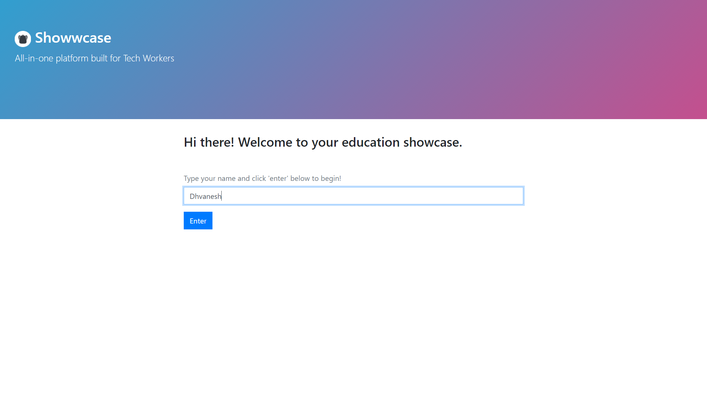
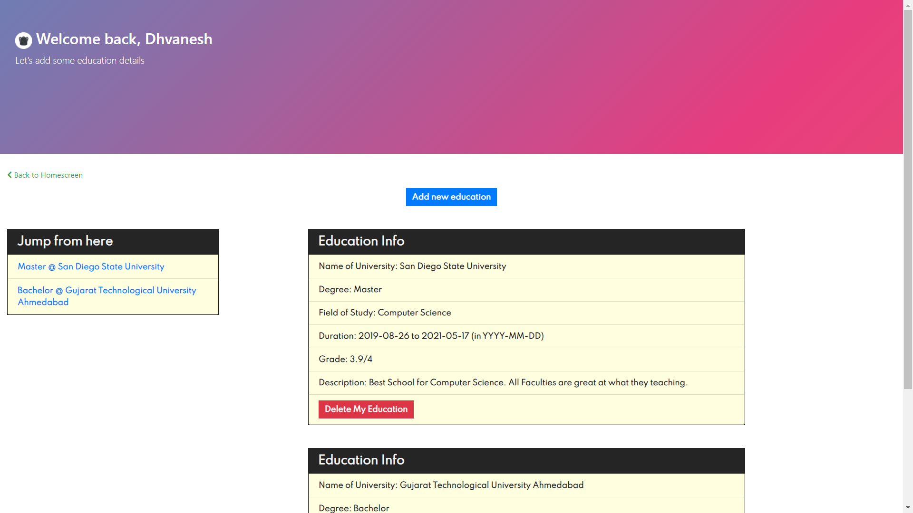
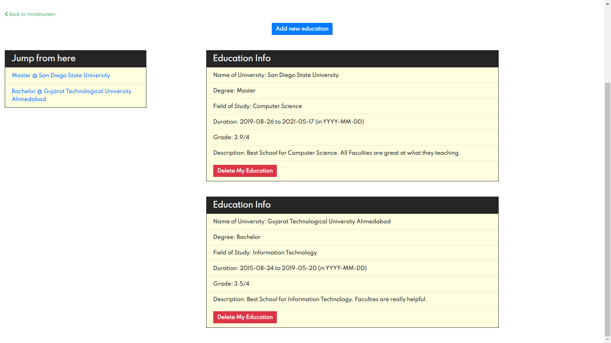
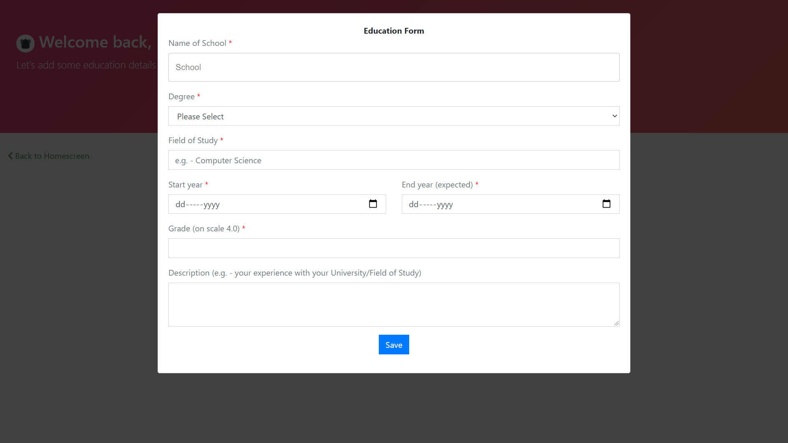
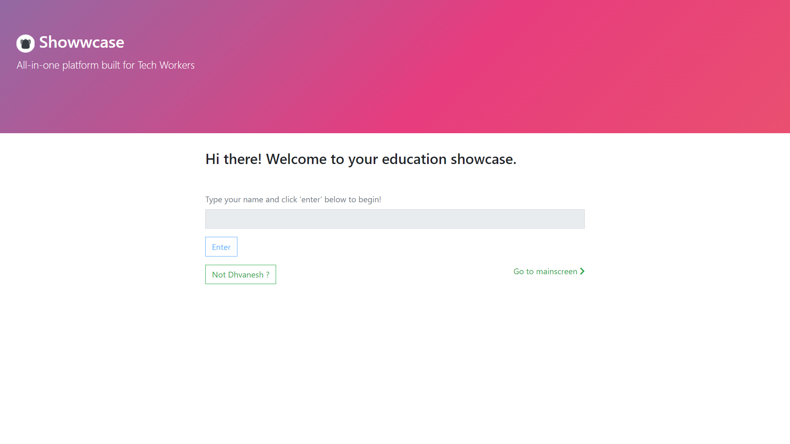

# Showwcase Developer Challenge

## About

<table>
<tr>
<td>
A web app showcasing one's education details. Since, there was no use of database/server, I have used LocalStorage for storing user's name and his/her education information.
</td>
</tr>
</table>

## Tech-stack used

* React
* TypeScript
* Bootstrap

## Setup

1. Clone the repo
2. Open terminal and go to repo's folder
3. run <code>npm install</code> first and then <code>npm start</code>

## Screenshots

### Homescreen
 

### Mainscreen

 

### Modal form

### When you go back to Homescreen again from Mainscreen

<strong>Happy Coding :)</strong>
